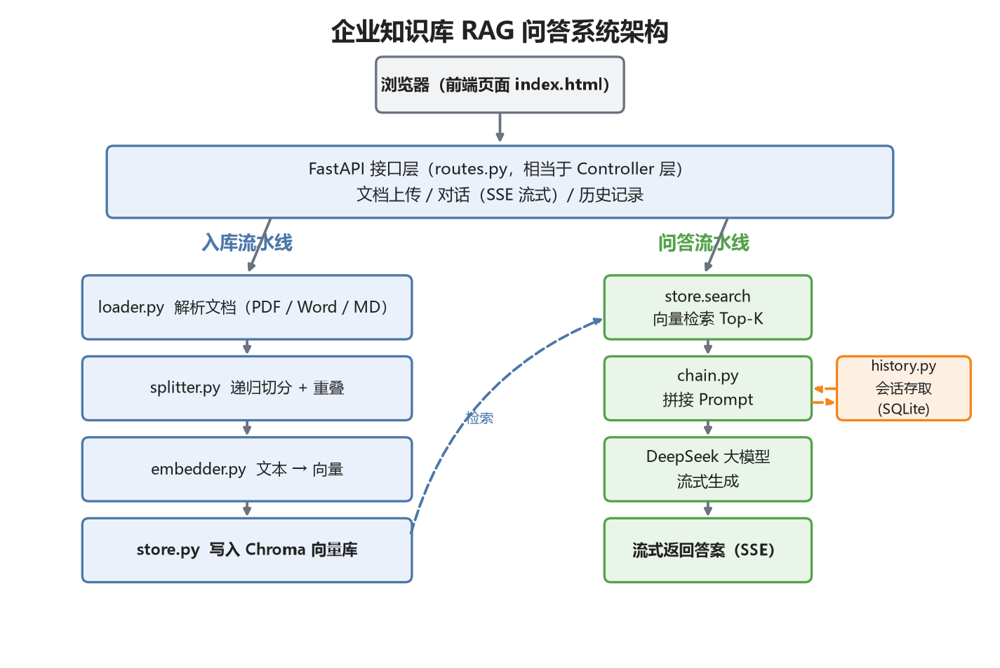

# 企业知识库 RAG 问答系统

基于 FastAPI + Chroma 的企业内部知识库问答系统。上传制度文档（PDF / Word / Markdown）后用自然语言提问，答案流式输出并标注引用来源（文件名 + 页码），支持多轮追问。

检索和生成链路的每个环节——解析、切分、Embedding、检索、生成——都是自己实现的，没有依赖 LangChain 之类的封装框架，出了问题能直接定位到具体环节，调参也方便。

## 功能特性

- **文档入库**：pypdf / python-docx / Markdown 按页解析，递归切分（400 字一片、60 字重叠），同名文档重新上传自动覆盖旧切片
- **检索**：DashScope text-embedding-v4 向量化 + Chroma 余弦相似度检索 Top-K，切片携带来源和页码元数据
- **流式问答**：DeepSeek 流式生成，SSE 打字机输出，引用来源先于答案推送
- **幻觉控制**：系统提示词约束 + 温度 0.3 + 检索为空直接兜底（不浪费一次模型调用）
- **引用溯源**：答案内 [资料N] 编号标注，前端同时展示来源列表
- **多轮会话**：sqlite 滑动窗口记忆（最近 10 条），零额外中间件
- **双后端抽象**：Embedding 支持在线/本地一键切换，向量库接口与 Milvus 对齐，平移成本低

## 实测数据

| 指标 | 结果 |
|---|---|
| 库内事实题准确率（15 题关键词口径） | 15/15 |
| 引用溯源正确率 | 15/15 |
| 超纲问题拒答率 | 3/3 |
| 多轮会话追问 | 通过 |
| 平均首答案字延迟 | 0.77 秒 |
| 单轮问答成本 | < 0.003 元 |

完整测试口径、逐题明细和复现命令见 [评测报告.md](评测报告.md)。

## 技术栈

Python 3.12 / FastAPI / Chroma / sqlite3 / OpenAI SDK（DeepSeek 对话 + DashScope Embedding）/ pypdf / python-docx

## 架构图



*图：左侧入库流水线（解析 → 切分 → 向量化 → 写入 Chroma），右侧问答流水线（检索 Top-K → 拼 Prompt → DeepSeek 流式生成）。*

## 快速开始

```bash
pip install -r requirements.txt -i https://pypi.tuna.tsinghua.edu.cn/simple

# 环境变量（PowerShell）
$env:DEEPSEEK_API_KEY="sk-你的DeepSeekKey"        # 对话模型
$env:DASHSCOPE_API_KEY="sk-你的百炼Key"            # Embedding（text-embedding-v4）

uvicorn app.main:app --host 0.0.0.0 --port 8000
# 浏览器打开 http://127.0.0.1:8000，先上传 docs/ 下的示例文档，再提问
```

## 接口

| 方法 | 路径 | 说明 |
|---|---|---|
| POST | /api/documents/upload | 上传文档（解析→切分→入库） |
| GET / DELETE | /api/documents | 文档列表 / 按文件名删除 |
| POST | /api/chat | SSE 流式问答 |
| GET | /api/sessions/{id}/history | 会话历史 |

## 设计要点

**切片为什么是 400 字？** 太大向量被多个主题稀释、检索不准还费上下文；太小语义不完整（"补签 3 次"的规定可能被拦腰切断）。60 字重叠兜底相邻语义。实际项目应按文档类型调参，用问答对评测验证。

**引用怎么实现的？** 每个切片入库时都带 {source, page} 元数据，检索命中后原样带回；拼 Prompt 时给每片编号并要求模型用 [资料N] 标注出处，前端再把来源列表单独渲染一遍。

**检索没有相似度阈值怎么办？** 当前 Top-K 检索必返回结果，超纲问题的拒答完全依赖提示词约束（本次实测 3/3 通过，但不是机制性保证）。加阈值 + 兜底话术是明确的下一步。

## 切换到 Milvus

Chroma 之于 Milvus，就像 H2 之于 MySQL。向量库操作收敛在一个类的四个方法（add_chunks / search / list_documents / delete_by_source），换库只需实现同签名的新类，上层代码零改动：

| Chroma | Milvus |
|---|---|
| PersistentClient | MilvusClient(uri="http://localhost:19530") |
| collection.add(...) | client.insert(collection_name, data) |
| collection.query(...) | client.search(collection_name, data=[向量], limit=k) |

## 目录结构

```
├── app/
│   ├── main.py               FastAPI 入口
│   ├── config.py             配置（全部走环境变量）
│   ├── api/                  路由与请求模型
│   └── rag/
│       ├── loader.py         PDF/Word/Markdown 解析
│       ├── splitter.py       递归切分（段落→句子→硬切 + 重叠窗口）
│       ├── embedder.py       Embedding（在线/本地双后端）
│       ├── store.py          Chroma 封装（Milvus 可平移）
│       ├── chain.py          检索 + 拼 Prompt + 流式生成
│       └── history.py        会话记忆（sqlite）
├── static/index.html         前端页面
├── docs/                     示例知识文档（内容为虚构）
└── 评测报告.md                实测数据与复现命令
```
